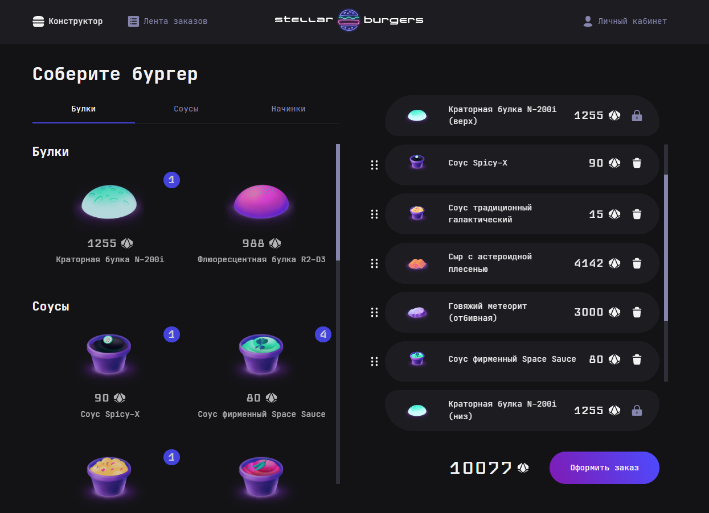

# 🍔 Stellar Burgers

---

## 🌐 Ссылки

* [Stellar Burgers]() - страница на хостинге GH Pages (ожидается);
* [Figma Step 1](https://www.figma.com/file/zFGN2O5xktHl9VmoOieq5E/React-_-Проектные-задачи_external_link?type=design&node-id=0-1&mode=design&t=UWtk8uxeXYakAP4o-0) - макет проекта (этап 1);
* [Figma Step 2](https://www.figma.com/file/ocw9a6hNGeAejl4F3G9fp8/React-_-Проектные-задачи-(3-месяца)_external_link?type=design&node-id=2973-2032&mode=design&t=nWSja3eEIAZncSrt-0) - макет проекта (этап 2);

---

## 📗 О проекте Stellar Burgers
__Stellar Burgers__ — проект космической бургерной (привет любителям футуризма и космических опер!).

На данный момент реализована __главная страница__ и раздел __Конструктор__, состоящая из _трёх компонентов_:
* __Заголовок__ 🔖 — с разделами _Конструктор_, _Лента заказов_, _Личный кабинет_;
* __Ингредиенты__ 🥗 — список доступных для заказа ингредиентов;
* __Конструктор бургера__ 🧩 — список добавленных в заказ ингредиентов.

А также _модальные окна_:
* __Подробная информация об ингредиенте__ - открывается при клике на карточку ингредиента и содержит данные о питательных веществах и энергетической ценности;
* __Подтверждение заказа__ - открывается при клике на кнопку `Оформить заказ` и содержит номер заказа.

_Главная страница_

---

## 🥣 Немного о реализации
* Реализована _front-end_ часть главной страницы Stellar Burgers.
* Проект _свёрстан_ для desktop-разрешения.
* Проект обладает _отзывчивым_ интерфейсом.
* Проект реализован на __React__ с использованием __Redux-хранилища__.
* __Модель__ для Redux-хранилища имеет разделение на _представление_ и _хранилище_.
* В Redux-хранилище имеются __объекты__ с информацией о:
  * состоянии запросов к API;
  * списке доступных к заказу ингредиентов;
  * списке добавленных в конструктор бургера ингредиентов;
  * текущем просматриваемого ингредиента;
  * созданном заказе.
* Для асинхронных операций с хранилищем используются __усилители__ (thunks).
* Проект поддерживает работу с __Redux DevTools__.
* В проекте используются __только__ _функциональные компоненты_.
* Для доступа к классовым возможностям используются __хуки__.
* Все компоненты имеют __props-валидацию__ PropTypes.
* Данные о доступных к заказу ингредиентах подгружаются с сервера с использованием API.
* Для запросов к API сервера подготовлена _универсальная fetch-функция_.
* Меню списка ингредиентов _интерактивно_: по нажатию на тип ингредиента происходит скролл к соответствующей категории; при сколле ингредиентов, тип ингредиента в меню переключается.
* Реализована __Drag'n'Drop__ функциональность:
  * Перетаскивание карточки ингредиента _в зону конструктора_ добавляет ингредиент в конструктор.
  * Перетаскивание элементов _внутри конструктора_ меняет их порядок (кроме булочек).
* Клик на _карточке_ ингредиента открывает модальное окно с подробным описанием.
* Клик на кнопке `Оформить заказ` открывает модальное окно с подтверждением и номером заказа, конструктор при этом очищается.
* Генерация номера заказа происходит путем отправки запроса с массивом из id ингредиентов на сервер.
* Заказ доступен от _одного_ любого ингредиента (булочки приобретаются парой, две разные булочки заказать нельзя).
* Итоговая стоимость подсчитывается _динамически_ в зависимости от набора ингредиентов, добавленных в конструктор.
* Приложение использует роутинг, реализованный с помощью __React Router__.
* Приложение содержит защищенные __HOC-компонентом__ роуты для авторизованных и неавторизованных пользователей.
* Реализован функционал __личного кабинета__ с регистрацией/логинингом, восстановлением пароля, профилем пользователя.
* Авторизация и соответствующие запросы к серверу построены на принципах использования __уникальных токенов__ (accessToken, refreshToken).
* Для запросов, использующих accessToken, реализована универсальная fetch-функция, производящая его обновление в случае окончания времени его жизни.
* Для работы с формами используется _кастомный хук_ __useForm__.
* Сборка проекта, минимизация и транспиляция кода на JS происходит с помощью инструмента __Webpack__ и сопутствующих плагинов.

---

## 📈 Планы по развитию проекта
* Реализовать функционал __личного кабинета__ с историей заказов
* Реализовать функционал __ленты заказов__
_Описанные выше пункты будут реализованы с использованием WebSockets_
---

## ⚙️ Cтек технологий
HTML, CSS, React, React DevTools, React-DnD, React-Router, Redux, Redux DevTools, React-Redux, Redux-Thunk, JavaScript, JSX, WebPack, Babel, GitHub

                

---

## 👨‍💻 Разработка

Разработка велась единолично
[Виктор Тарапата](https://github.com/vveb) ✊

---

### 📜 Инструкция по запуску на локальной машине

- Установить [Node.js](https://nodejs.org/ru/)
- Клонировать репозиторий `git clone git@github.com:vveb/react-stellar-burger.git`
- Установить зависимости `npm install`
- Запустить приложение `npm run start`
